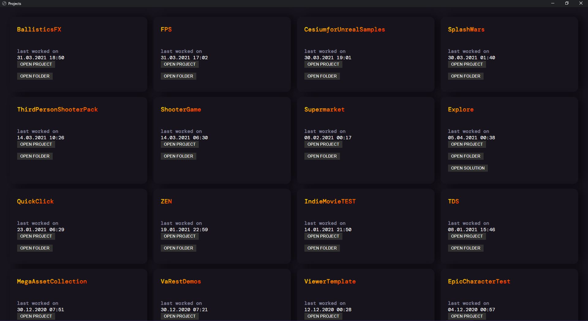

# Epic-Project-Browser

[Download Link (Installation Setup)](https://github.com/Problem-Solving-Agency-Zenahr-Barzani/Epic-Project-Browser/releases/download/0.1.0-alpha/Epic_Project_Browser_Setup_0.1.0-alpha.zip)

# Features

- Replaces Epic Games Launcher for browsing and opening your Unreal Engine projects
- Browse your projects
- Open your projects

*More coming in the next release!

# Feedback

Join the official Discord Server 	(〃＾▽＾〃)

